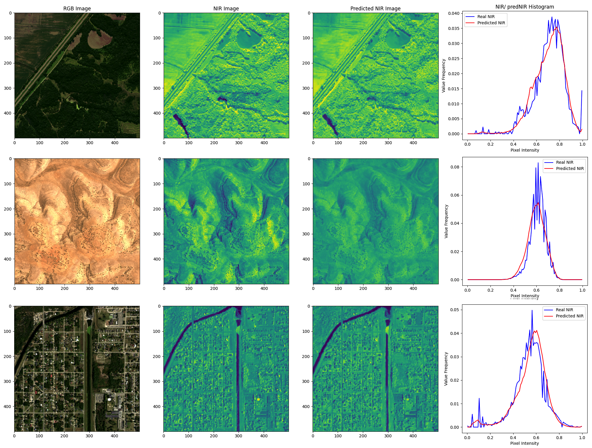

# NIR-GAN: Synthetic NIR band from RGB Remote Sending Imagery


## Overview
NIR-GAN is a project dedicated to predicting the Near-Infrared (NIR) band from RGB Sentinel-2 satellite imagery using a Generative Adversarial Network (GAN). The goal is to train a model that can generate an accurate synthetic NIR band, providing useful NIR information where only RGB data in the S2 spectral domain is available.

## Use Case
For example, in Super-Resolution datasets, high-resolution (HR) aerial imagery often serves as a reference for producing low-resolution (LR) images that mimic Sentinel-2 (S2) imagery. This process typically involves spectrally matching the HR aerial image to a corresponding S2 acquisition, followed by degradation to create the LR version.  

However, many aerial images, especially those available as open-source data, contain only RGB bands and lack the NIR band. This gap results in S2-like RGB images without a corresponding NIR channel, limiting their utility for vegetation analysis, water body delineation, and other applications that rely on NIR data.  

In this scenario, synthesizing the NIR band from RGB bands is crucial. By using a GAN to predict the NIR band, this approach enables the generation of a synthetic NIR channel, enriching RGB-only datasets to approximate S2 capabilities and expanding their applications in environmental monitoring, agricultural assessments, and urban studies. This approach thus leverages RGB-only imagery to unlock additional spectral insights, bridging data gaps in multispectral analysis.  

## Project Objectives

- **NIR Prediction**: Use a GAN architecture to synthesize the NIR band directly from the RGB bands of Sentinel-2 imagery.
  
- **Visualization of NIR Quality**: Track the GAN’s progress and evaluate the quality of the predicted NIR bands without relying on indices like NDVI that require both true NIR and red bands.

## Training Data
The model is trained using the SEN2NAIP-v2 satellite imagery dataset, specifically focusing on RGB inputs and the corresponding NIR band. This dataset provides the necessary spectral information in the visible and near-infrared range to train the GAN for NIR prediction.
- **Input Data**: Sentinel-2-like 2.5m RGB Bands, used as input to the generator to synthesize the NIR band.
- **Target Data**: Sentinel-2-like 2.5m NIR Band, serves as the ground truth for training the model, allowing it to learn the mapping from RGB to NIR.  
Note: The spectral range of the input data is in the domain of Sentinel-2 images.  

### Output Data
- **Synthetic NIR Images**: Generated NIR bands based solely on the input RGB bands, with Sentinel-2-like spectral charachteristics.

## Architecture
The project features an implementation of the Pix2Pix conditional GAN with approximately 11 million parameters.  
- **Generator**: The Pix2Pix generator uses an resnet encoder-decoder architecture, leveraging conditional information from the RGB bands to enhance the synthetic NIR output.
- **Discriminator**: The Pix2Pix discriminator accepts both the generated NIR band and the corresponding RGB input to evaluate the consistency between the RGB and synthetic NIR. This approach provides additional feedback, helping the model learn more accurate mappings from RGB to NIR.

### Installation
Clone the repository:

```bash
git clone https://github.com/simon-donike/NIR_SRGAN.git
cd NIR_SRGAN
```

### Train on Custom Dataset
To train on your own dataset, switch out the pytorch-lightning datamodule in the train.py script with your own. Your dataloader needs to return a dictionary with the following keys:
- "rgb": Bx3xWxH RGB image tensor
- "nir": Bx1xWxH NIR image tensor

Features:
- Multi-GPU support
- Metric and Image Logging: pass WandB Callback to PL-Trainer to enable wandb logging
- Adjust hyperparamters in config file, such as
    - model sizes, inputs and properties
    - finetuning on previous checkpoints
    - padding operations for edge artifact removal
    - learning rate
    - loss weights
    - optimizer scheduler settings (patience, factor, etc)
    - etc.

