## Table of Contents
- [NIRGAN: Intro](#nir-gan-synthetic-nir-band-from-rgb-remote-sending-imagery)
  - ["Project Objectives"](#project-objectives)
  - [Results and Validation Showcase](#results-and-validation-showcase)
- [Model Information](#model-information)
  - [Training Data](#training-data)
  - [Architechture](#architechture)
    - [SatCLIP Geographic Priors](#satclip-geographic-priors)
    - [Application-specific losses](#application-specific-losses)
- [Installation](#installation)
- [Train on Custom Dataset](#train-on-custom-dataset)
- [Use Case: Semi-Synthetic Dataset Generation](#use-case-semi-synthetic-dataset-generation)


# NIR-GAN: Synthetic NIR band from RGB Remote Sending Imagery
NIR-GAN is a project dedicated to predicting the Near-Infrared (NIR) band from RGB satellite imagery using a Generative Adversarial Network (GAN). The goal is to train a model that can generate an accurate synthetic NIR band, providing useful NIR information where only RGB data is available.  
**Highlights:**
- **Sensor-agnostic**: trained to provide realistic NIR regardless of sensor
- **Multi-scale inputs**: trained on a variety of resolutions  
- **Location Priors**: SatCLIP embeddings provide geographic context
- **Application-specific Loss**: refined loss formulation including spectral indices improve spectral coherence  

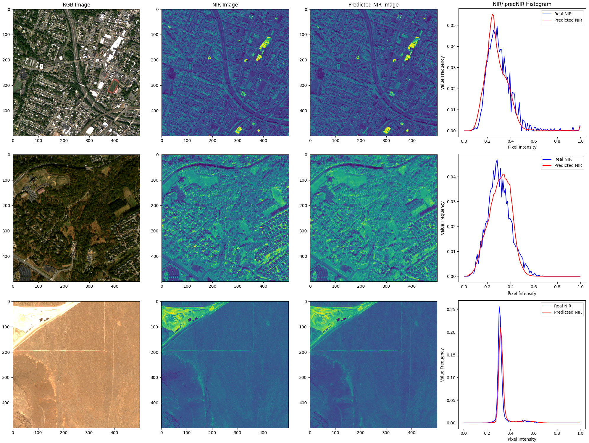


## Project Objectives

The goal of NIR-GAN is to address a persistent limitation in remote sensing workflows: the absence of near-infrared (NIR) information in high-resolution (HR) or legacy RGB-only imagery. While NIR bands are essential for a wide range of applications—including vegetation monitoring, land cover classification, urban analysis, and disaster response—they are often missing in datasets derived from very high-resolution (VHR) sensors or RGB-only basemaps.

NIR-GAN is designed to bridge this gap by synthesizing the NIR band directly from RGB imagery using a conditional generative adversarial network (cGAN). It enables the transformation of RGB-only datasets into pseudo-multispectral datasets by learning spectral mappings through image-to-image translation.


## Results and Validation Showcase

**NIR Prediction**: Use a GAN architecture to synthesize the NIR band directly from the RGB bands of multi-scale EO imagery.  
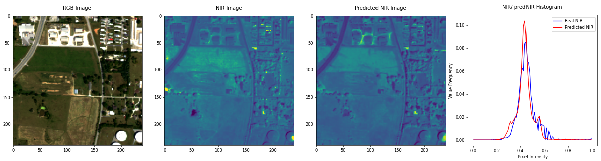
  
**Visualization of NIR Quality**: Track the GAN’s progress and evaluate the quality of the predicted NIR bands, as well as derivative Indices like NDVI, NDWI, and EVI.  
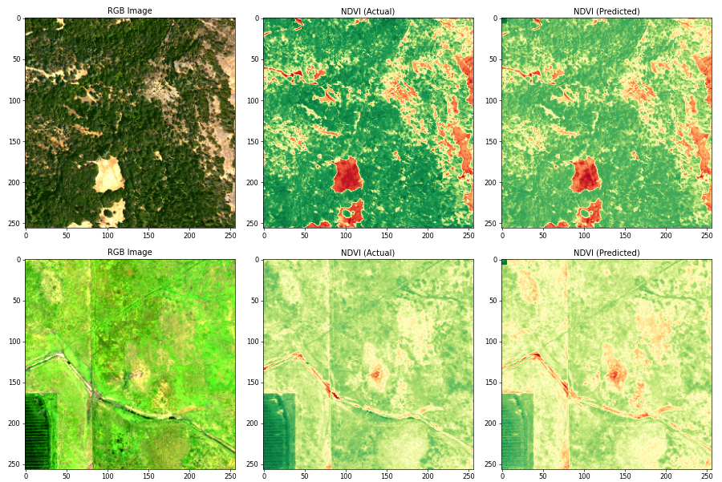


**Time-Series of NDVI development**: Track NDVI over crop cycles and seasonality.  
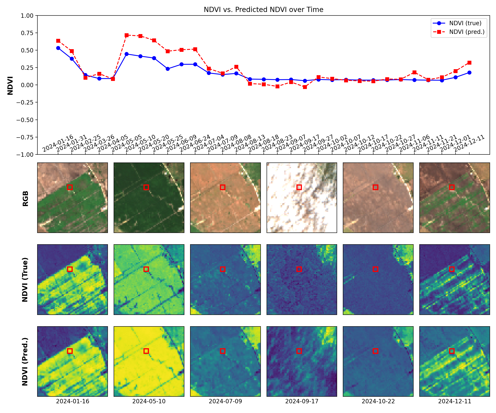

# Model Information
## Training Data
The model is trained using
- a collection of worldwide-sampled Landsat-8 and Sentinel-2 images,
- SEN2NAIP-v2 [1], 
- worldstrat [2], 
- ESA SPOT-6 archive data [6]
  
from which the RGB inputs and the corresponding NIR band have been extracted. These datasets provide the necessary spectral information in the visible and near-infrared range to train the GAN for NIR prediction, in multiple scales, and with a worldwide geographic distribution. The images are randomly sampled from the different datasets during training. In order to make the model scale-agnostic, we randomly sample a derivative resolution form the datasets according to the following table.  

| Sensor      | Patches | Native Spatial Resolution | Geographic Distribution |
|-------------|---------|---------------------------|-------------------------|
| Landsat-8   | 20,000  | 30m                       | Worldwide               |
| Sentinel-2  | 75,000  | 10m                       | Worldwide               |
| SPOT-6      | 15,000  | 5m                        | Worldwide               |
| NAIP        | 35,000  | 2.5m                      | USA                     |

  
- **Input Data**: RGB bands, used as input to the generator to synthesize the NIR band.
- **Target Data**: NIR band, serves as the ground truth for training the model, allowing it to learn the mapping from RGB to NIR.  
- **Output Data: Synthetic NIR Images**: Generated NIR bands based solely on the input RGB bands, with Sentinel-2-like spectral charachteristics.

## Architecture
The project features an implementation of the Pix2Pix conditional GAN with approximately 11 million parameters [3].  
- **Generator**: The Pix2Pix generator uses an resnet encoder-decoder architecture, leveraging conditional information from the RGB bands to enhance the synthetic NIR output. Geographic Priors are injected into the model.
- **Discriminator**: The Pix2Pix discriminator accepts both the generated NIR band and the corresponding RGB input to evaluate the consistency between the RGB and synthetic NIR. This approach provides additional feedback, helping the model learn more accurate mappings from RGB to NIR.
- **SatCLIP**: 400k parameter model that creates spatial embeddings from latitude/longitude [4]. This information is sent through a fully connected layer to project it in the 2D-space, before being scaled through a learnable paramater and then beeing injected in the model (see schema).


### SatCLIP Geographic Priors

SatCLIP [4] is a way of encoding geographic information based on a lat-lon location. based on a large worldwide dataset, the embeddings are created to represent the unique conditions anywhere on earth and provide priors to models further down the processing pipeline. In the image below, the 1,256-dimensional spatial embedding is reprojected to a 3-dimensional RGB space via PCA. It is evident that the SatCLIP model encodes these geographical varieties into clusters correlated with vegetation and climatic zones, where regions with similar properties appear to have similar embeddings and vice versa. This is especially evident when comparing the distribution of rain forests (Brazil and West Africa) and deserts (Sahara, Australia, and Atacama) with the color similarities of the embeddings.

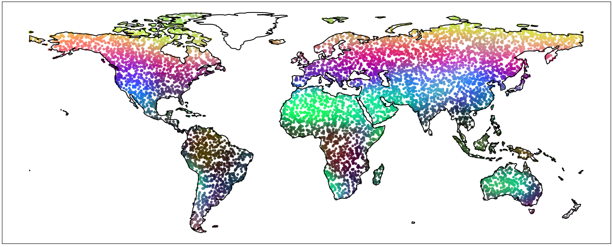

These SatCLIP embeddings are injected into the NIR-GAN model. The spatial prior is calculated, reshaped to a spatial vector via a fully connected layer and then scaled by a learnable scale-parameter, before dot-wise multiplication. The embeddigns are injected after the downscaling layers, where general feautres have already been extracted, and before the ResNEt blocks, where said information is refined. The embeddings lead to better generalization, since they provide geographic, climate, vegetational and anthropogenic context to the model.

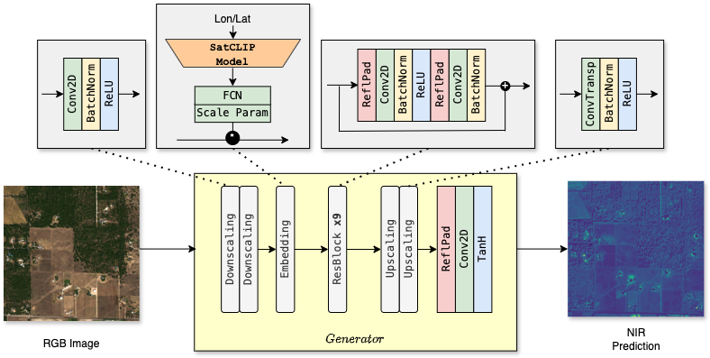

### Application-specific losses

We combine standard reconstruction losses (L1 and Earth Mover’s Distance on histograms) with an application-specific loss to promote spectral accuracy. The application-specific loss computes the L1 difference between remote sensing indices (NDVI, NDWI, EVI) derived from both the predicted and ground truth NIR, effectively guiding the model to preserve physically meaningful spectral relationships across RGB and NIR bands. All losses are combined in a weighted total loss.

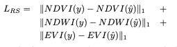


# Installation
1. Clone the repository
```bash
git clone https://github.com/simon-donike/NIR-SRGAN.git
cd NIR-SRGAN
```
2. Install requirements into virtual environment
```bash
python3 -m venv venv
source venv/bin/activate  # On Windows use `venv\Scripts\activate`
pip install -r requirements.txt
```
3. Download checkpoints and synthetic dataset from [HuggingFace](https://huggingface.co/simon-donike/NIR-GAN).


## Train on Custom Dataset
To train on your own dataset, switch out the pytorch-lightning datamodule in the train.py script with your own. Your dataloader needs to return a dictionary with the following keys:
- "rgb": Bx3xWxH RGB image tensor
- "nir": Bx1xWxH NIR image tensor, then run
```python
python train.py --satclip y
```

Features:
- Multi-GPU support
- Metric and Image Logging to **[WandB](https://wandb.ai/)**: pass callback to PL-Trainer to enable wandb logging
- Adjust hyperparamters in config file, such as
    - model sizes, inputs and properties
    - finetuning on previous checkpoints
    - padding operations for edge artifact removal
    - learning rate
    - loss weights (EMD, RS Indices, Adv. Loss, L1...)
    - optimizer scheduler settings (patience, factor, etc)
    - etc.


# Use Case: Semi-Synthetic Dataset Generation
### Motivation
In many remote sensing super-resolution pipelines, we assume access to co-registered high-resolution (HR) RGB images and corresponding low-resolution (LR) multispectral imagery (e.g., Sentinel-2 with an NIR band). However, HR images—often aerial or commercial satellite data—frequently contain only RGB channels, lacking the crucial NIR information needed for tasks like vegetation monitoring, water body delineation, or land cover classification.

To address this, we propose a **semi-synthetic dataset generation pipeline** that enriches HR RGB imagery with a *synthetic* NIR band predicted from the RGB data. This enables the creation of pseudo-multispectral HR data where none existed before, and allows us to:
- Simulate Sentinel-2-like 4-band (RGB+NIR) imagery at higher resolutions.
- Train and evaluate super-resolution or domain adaptation models in the absence of true HR NIR.
- Explore new downstream applications on previously limited RGB-only datasets.

### Methodology

We use our trained NIR-GAN model to synthesize the NIR band from HR RGB images, using spatial context from aligned LR RGB-NIR (e.g. Sentinel-2) as a reference for histogram matching.

The process involves:
1. **Loading a pre-trained Pix2Pix model** trained to predict NIR from RGB.
2. **Feeding HR RGB patches into the generator**.
3. **Optionally matching histograms** of the output to low-resolution Sentinel-2 NIR for spectral realism.
4. **Saving the predicted NIR bands** as `.npz` files for use in further experiments.

This results in a dataset of HR RGB + synthetic NIR 4-channel data.

### Example Code Snippet
Run `create_synthetic_dataset.py` to create a super-resolution dataset with a synthetic HR-NIR band based on our example data or substitute your own.  
```python
# Load model
model = Px2Px_PL(config)
model.load_state_dict(torch.load("logs/best/S2.ckpt")['state_dict'], strict=False)
model = model.eval().to(device)

# Run inference
for batch in dataloader:
    hr_rgb = batch["hr"].to(device)
    with torch.no_grad():
        synth_nir = model(hr_rgb).cpu()
    
    # Optional: Match predicted NIR to Sentinel-2 NIR histogram
    matched_nir = histogram_match(synth_nir, batch["s2_nir"])
    
    # Save NIR bands
    for nir, name in zip(matched_nir, batch["id"]):
        save_image(nir, "data/synthDataset/synth_nirs", name)
```
Each predicted NIR band is saved as a compressed `.npz` file using `numpy.savez_compressed()` for storage efficiency and ease of downstream loading.

### Output Structure
After running the generation script, your dataset will look like:
```bash
data/synthDataset/
├── hr/               # High-res RGB inputs
├── lr/               # Low-res RGBNIR Sentinel-2 (reference)
├── synth_nirs/       # Synthesized NIR bands (.npz)
```

### Examples
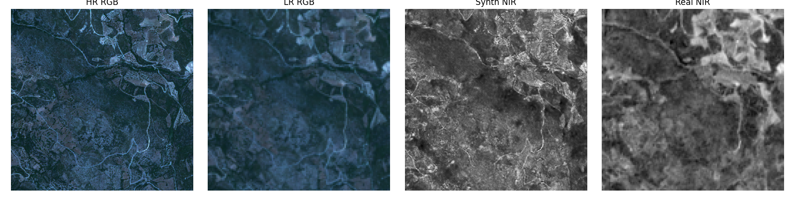
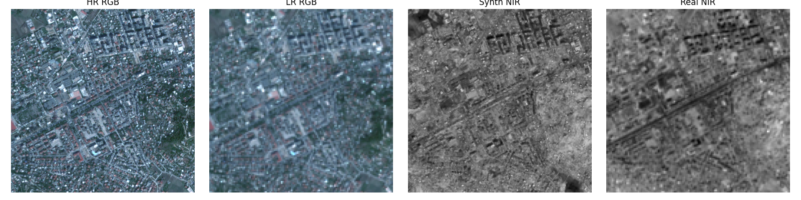
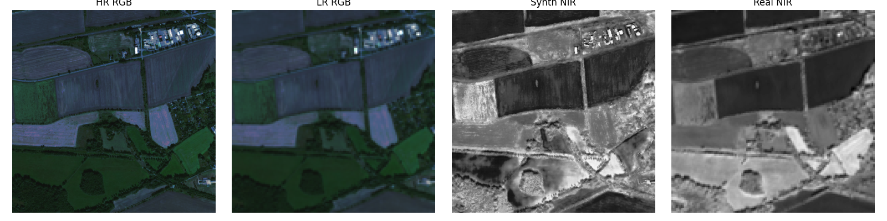
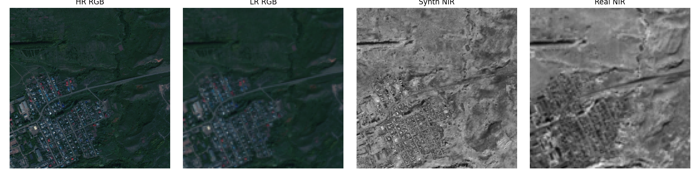


#### Sources
[1] [SEN2NAIP](https://huggingface.co/datasets/isp-uv-es/SEN2NAIP)  
[2] [worldstrat](https://worldstrat.github.io/)  
[3] [Pix2Pix](https://github.com/phillipi/pix2pix)  
[4] [SatCLIP](https://github.com/microsoft/satclip)  
[5] [S100K](https://github.com/microsoft/satclip?tab=readme-ov-file#use-of-the-s2-100k-dataset)  
[6] [ESA SPOT-6 Data](https://earth.esa.int/eogateway/catalog/spot-6-and-7-esa-archive)  


#### Acknowledgements
This work builds upon the [Pix2Pix](https://github.com/phillipi/pix2pix) framework, PatchGAN architecture, and [SatCLIP embeddings](https://github.com/microsoft/satclip). Funding support was provided by the [ESA Φ-lab](https://philab.esa.int/) within the project "OpenSR".
