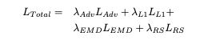

# NIR-GAN: Synthetic NIR band from RGB Remote Sending Imagery
NIR-GAN is a project dedicated to predicting the Near-Infrared (NIR) band from RGB satellite imagery using a Generative Adversarial Network (GAN). The goal is to train a model that can generate an accurate synthetic NIR band, providing useful NIR information where only RGB data is available. Highlights:
- **sensor-agnostic**: trained to provide realistic NIR regardless of sensor
- **multi-scale inputs**: trained on a variety of resolutions  
- **Location Priors**: SatCLIP embeddings provide geographic context
- **Application-specific Loss**: refined loss formulation including spectral indices improve spectral coherence  


## Use Case
For example, in Super-Resolution datasets, high-resolution (HR) aerial imagery often serves as a reference for producing low-resolution (LR) images that mimic Sentinel-2 (S2) imagery. This process typically involves spectrally matching the HR aerial image to a corresponding S2 acquisition, followed by degradation to create the LR version.  

However, many aerial images, especially those available as open-source data, contain only RGB bands and lack the NIR band. This gap results in S2-like RGB images without a corresponding NIR channel, limiting their utility for vegetation analysis, water body delineation, and other applications that rely on NIR data.  

In this scenario, synthesizing the NIR band from RGB bands is crucial. By using a GAN to predict the NIR band, this approach enables the generation of a synthetic NIR channel, enriching RGB-only datasets to approximate S2 capabilities and expanding their applications in environmental monitoring, agricultural assessments, and urban studies. This approach thus leverages RGB-only imagery to unlock additional spectral insights, bridging data gaps in multispectral analysis.  

## Project Objectives

**NIR Prediction**: Use a GAN architecture to synthesize the NIR band directly from the RGB bands of multi-scale EI imagery.  

  
**Visualization of NIR Quality**: Track the GAN’s progress and evaluate the quality of the predicted NIR bands, as well as derivative Indices like NDVI, NDWI, and EVI.  


**Time-Series of NDVI development**: Track NDVI over crop cycles and sasonality.  


## Training Data
The model is trained using
- a collection of worldwide-sampled Landsat-8 and Sentinel-2 images,
- SEN2NAIP-v2 [1], 
- worldstrat [2], 
from which the RGB inputs and the corresponding NIR band have been extracted. These datasets provide the necessary spectral information in the visible and near-infrared range to train the GAN for NIR prediction, in multiple scales, and with a worldwide geographic distribution. The images are randomly sampled from the different datasets during training. In order to make the model scale-agnostic, we randomly sample a derivative resolution form the datasets according to the following table.  

| Sensor      | Patches | Native Spatial Resolution | Geographic Distribution |
|-------------|---------|---------------------------|-------------------------|
| Landsat-8   | 20,000  | 30m                       | Worldwide               |
| Sentinel-2  | 75,000  | 10m                       | Worldwide               |
| SPOT-6      | 15,000  | 5m                        | Worldwide               |
| NAIP        | 35,000  | 2.5m                      | USA                     |

  
- **Input Data**: RGB bands, used as input to the generator to synthesize the NIR band.
- **Target Data**: NIR band, serves as the ground truth for training the model, allowing it to learn the mapping from RGB to NIR.  
Note: The spectral range of most of the input data is in the domain of Sentinel-2 images.  

### Output Data
- **Synthetic NIR Images**: Generated NIR bands based solely on the input RGB bands, with Sentinel-2-like spectral charachteristics.

## Architecture
The project features an implementation of the Pix2Pix conditional GAN with approximately 11 million parameters [3].  
- **Generator**: The Pix2Pix generator uses an resnet encoder-decoder architecture, leveraging conditional information from the RGB bands to enhance the synthetic NIR output. Geographic Priors are injected into the model.
- **Discriminator**: The Pix2Pix discriminator accepts both the generated NIR band and the corresponding RGB input to evaluate the consistency between the RGB and synthetic NIR. This approach provides additional feedback, helping the model learn more accurate mappings from RGB to NIR.
- **SatCLIP**: 400k parameter model that creates spatial embeddings from latitude/longitude [4]. This information is sent through a fully connected layer to project it in the 2D-space, before being scaled through a learnable paramater and then beeing injected in the model (see schema).


### SatCLIP Geographic Priors

SatCLIP [4] is a way of encoding geographic information based on a lat-lon location. based on a large worldwide dataset, the embeddings are created to represent the unique conditions anywhere on earth and provide priors to models further down the processing pipeline. In the image below, the 1,256-dimensional spatial embedding is reprojected to a 3-dimensional RGB space via PCA. It is evident that the SatCLIP model encodes these geographical varieties into clusters correlated with vegetation and climatic zones, where regions with similar properties appear to have similar embeddings and vice versa. This is especially evident when comparing the distribution of rain forests (Brazil and West Africa) and deserts (Sahara, Australia, and Atacama) with the color similarities of the embeddings.


These SatCLIP embeddings are injected into the NIR-GAN model. The spatial prior is calculated, reshaped to a spatial vector via a fully connected layer and then scaled by a learnable scale-parameter, before dot-wise multiplication. The embeddigns are injected after the downscaling layers, where general feautres have already been extracted, and before the ResNEt blocks, where said information is refined. The embeddings lead to better generalization, since they provide geographic, climate, vegetational and anthropogenic context to the model.


### Application-specific losses

We combine standard reconstruction losses (L1 and Earth Mover’s Distance on histograms) with an application-specific loss to promote spectral accuracy. The application-specific loss computes the L1 difference between remote sensing indices (NDVI, NDWI, EVI) derived from both the predicted and ground truth NIR, effectively guiding the model to preserve physically meaningful spectral relationships across RGB and NIR bands. All losses are combined in a weighted total loss.




### Installation
Clone the repository:

```bash
git clone https://github.com/simon-donike/NIR_SRGAN.git
cd NIR_SRGAN
```

### To Come:
- MLstack compliant model release for easy inference  
- Paper publication

### Train on Custom Dataset
To train on your own dataset, switch out the pytorch-lightning datamodule in the train.py script with your own. Your dataloader needs to return a dictionary with the following keys:
- "rgb": Bx3xWxH RGB image tensor
- "nir": Bx1xWxH NIR image tensor

Features:
- Multi-GPU support
- Metric and Image Logging: pass WandB Callback to PL-Trainer to enable wandb logging
- Adjust hyperparamters in config file, such as
    - model sizes, inputs and properties
    - finetuning on previous checkpoints
    - padding operations for edge artifact removal
    - learning rate
    - loss weights (EMD, RS Indices, Adv. Loss, L1...)
    - optimizer scheduler settings (patience, factor, etc)
    - etc.

### Sources
[1] [SEN2NAIP](https://huggingface.co/datasets/isp-uv-es/SEN2NAIP)  
[2] [worldstrat](https://worldstrat.github.io/)  
[3] [Pix2Pix](https://github.com/phillipi/pix2pix)  
[4] [SatCLIP](https://github.com/microsoft/satclip)  
[5] [S100K](https://github.com/microsoft/satclip?tab=readme-ov-file#use-of-the-s2-100k-dataset)